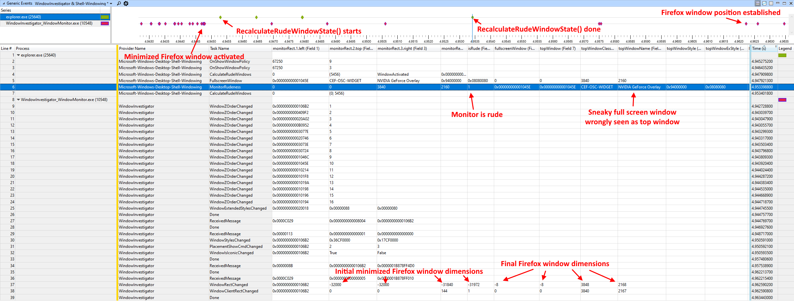

# WindowInvestigator: a window manager investigation toolbox
*Brought to you by [Etienne Dechamps][] - [GitHub][]*

WindowInvestigator is a small set of highly specialized tools that can be used
to investigate Windows window manager issues. It was developed with the goal of
investigating the behaviour of a piece of internal Windows code called the Rude
Window Manager; see [RudeWindowFixer][] for more background. However it might
also be useful in other scenarios.

For example, WindowInvestigator is what made it possible to come up with
analyses like the following:

## WindowManagementLogging tracing

Some of the internal Windows shell window management code, including Rude Window
Manager code, uses an internal class called `WindowManagementLogging` to log
various events and the results of computations. I found these logs to be
extremely relevant to my investigation.

`WindowManagementLogging` acts as an [Event Tracing for Windows (ETW)][]
provider. Through binary reverse engineering, it has been determined that the
provider GUID is `F84AA759-31D3-59BF-2C89-3748CF17FD7E`.

You can use this GUID in event consumers to receive the log. For example you
can enter the GUID directly in [TraceView][] for real time logging, or you can
load the included [`WindowManagementLogging.wprp`][] [recording profile][] into
the [Windows Performance Recorder (WPR)][] for a more thorough analysis. The
Provider Name will appear as `Microsoft-Windows-Desktop-Shell-Windowing`.

## Shell Core Provider logging

Some of the internal Windows taskbar state management code uses the [Shell Core
logging provider][] to log various events which can be useful for correlation.

This is  an [Event Tracing for Windows (ETW)][] provider whose GUID is
`30336ED4-E327-447C-9DE0-51B652C86108` (credit goes to Geoff Chappell).

You can use this GUID in event consumers to receive the log. For example you
can enter the GUID directly in [TraceView][] for real time logging, or you can
load the included [`ShellCore.wprp`][] [recording profile][] into the
[Windows Performance Recorder (WPR)][] for a more thorough analysis. The
Provider Name will appear as `Microsoft-Windows-Shell-Core`.

## WindowMonitor

WindowMonitor is a command line tool that is aimed at investigating window
states and how they change over time. If called without any command line
arguments, it will:

- Dump an initial list of all [visible windows][] to the standard output, along
  with the values of various window properties.
  - This is to provide the initial reference starting point.
  - That list is also logged through the tracing provider (see below). Every
    5 seconds, it is logged through the tracing provider again to provide
    regular reference points.
- Create a [message-only window][] that:
  - Registers and listens to [shell hook messages][].
    - The message identifier for shell hook messages is typically `0xC029`, but
      that is not necessarily always the case. Look for the `Started` trace
      event to determine the actual message identifier.
  - Registers and listens to [appbar][] messages.
    - WindowMonitor uses `WM_USER` (`0x400`) as the identifier for appbar
      messages.
    - An appbar message to watch out for is [`ABN_FULLSCREENAPP`][] which
      is sent as a consequence of the monitor rudeness state changing.
  - Sends a [`WM_TIMER`][] (`0x113`) message to itself every 16 milliseconds.
- Every time any message is received on the aforementioned window, WindowMonitor
  logs it through an [Event Tracing for Windows (ETW)][] provider.
  - The provider GUID is `500D9509-6850-440C-AD11-6EA625EC91BC`. You can enter
    that GUID directly in [TraceView][] for real time logging, or you can load
    the included [`WindowInvestigator.wprp`][] [recording profile][] into the
    [Windows Performance Recorder (WPR)][] for a more thorough analysis. The
    Provider Name will appear as `WindowInvestigator`.
- In addition to logging the message itself, every time a message is received,
  WindowMonitor will go through every visible window and log any changes that
  may have occurred to any of the watched window properties (e.g. styles,
  position) since the last message.
  - This also includes changes to the Z-order, which are determined by watching
    for changes in the order in which windows are returned from
    [`EnumWindows()`][].

WindowMonitor can also be called with a specific window handle as a command line
argument (e.g. `WindowMonitor.exe 0x4242`). In that case, WindowMonitor will not
listen for messages; instead, it will check the state of that window every 2
milliseconds and will log any changes. Note that Z-order changes are not
reported in this mode. This single-window mode is useful when you need more
precise timing information.

Note: it is recommended to run WindowMonitor as Administrator; this will allow
it to set the Real-Time [process priority class][] to achieve the most precise
timing.

Note: WindowMonitor might not run on some Windows versions because it retrieves
a couple of undocumented window properties through reverse-engineered
`user32.dll` Windows API entry points that might not exist in all versions. You
might need to adjust the code to remove calls to these APIs.

## DelayedPosWindow

This extremely simple tool simply displays a standard window that has the
particularity of injecting a customizable delay in the processing of
[`WM_WINDOWPOSCHANGING`][] messages. This is useful to simulate applications
that are slow to process these messages (e.g. Firefox), and to force latent race
conditions to the surface.

The delay is specified in milliseconds as a command line argument. For example,
`DelayedPosWindow.exe 100` will make every [`WM_WINDOWPOSCHANGING`][] message
take ~100 ms to process.

Similar to WindowMonitor, DelayedWindowPos will trace every window message
received, as well as details of `WM_WINDOWPOSCHANGING` messages. The trace
provider details are the same as WindowMonitor.

## TransparentFullscreenWindow

This trivial command line tool simply displays a window that has the
`WS_EX_LAYERED` and `WS_EX_TRANSPARENT` [extended window styles][]. It also
makes the window full screen by setting its dimensions to be the same as the
screen. This emulates a "sneaky" full screen window such as the GeForce
Experience overlay window.

If you pass the `"topmost"` command line parameter, the full screen window will
also have the `WS_EX_TOPMOST` style, i.e. it will be "always on top".

Note that this tool has only been tested in a single-monitor setup. The
dimensions of the window might be incorrect on a multi-monitor setup.

## BroadcastShellHookMessage

This command line tool [broadcasts][] arbitrary [shell hook messages][]. The
main purpose is to deliver a message to the Rude Window Manager. The window that
the Rude Window Manager listens on is a bit hard to find - it's one of several
`WorkerW` windows under the desktop window of `explorer.exe`. Broadcasting is a
quick and dirty way of getting the message across without having to find the
window.

The program takes two hexadecimal arguments which are the values to send as
`wParam` and `lParam`, in this order.

Here's a few examples of command line parameters:

- `0x16 0x0` sends `HSHELL_MONITORCHANGED` with a null window, which simply
  compels the Rude Window Manager to recalculate its state.
- `0x35 0x4242` will compel the Rude Window Manager to add window handle
  `0x4242` to its set of full screen windows.
- `0x36 0x4242` will compel the Rude Window Manager to remove window handle
  `0x4242` to its set of full screen windows.

## Other recommended tools

- [GuiPropView][] is a nice tool for looking at window properties in general.
- [Spy++][] is useful to monitor the messages that a given window is receiving.
  - Make sure to use the 64-bit version when monitoring a 64-bit process,
    otherwise no messages will be shown.
- For reverse engineering Windows binaries, I used [Ghidra][].
  - I found it to be quite effective, although the relevant code is littered
    with C++ virtual function calls which are sadly [very][ghidrav1]
    [painful][ghidrav2] to analyse in Ghidra.
  - Whatever software you use, do make sure to use the [public Microsoft
    symbols][] as these will make your life much easier!

## Developer information

WindowInvestigator is designed to be built using CMake within the Microsoft
Visual C++ 2019 toolchain native CMake support.

There are no dependencies besides the Windows SDK.

[`ABN_FULLSCREENAPP`]: https://docs.microsoft.com/en-us/windows/win32/shell/abn-fullscreenapp
[appbar]: https://docs.microsoft.com/en-us/windows/win32/shell/application-desktop-toolbars
[broadcasts]: https://docs.microsoft.com/en-us/windows/win32/api/winuser/nf-winuser-broadcastsystemmessage
[Etienne Dechamps]: mailto:etienne@edechamps.fr
[`EnumWindows()`]: https://docs.microsoft.com/en-us/windows/win32/api/winuser/nf-winuser-enumwindows
[Event Tracing for Windows (ETW)]: https://docs.microsoft.com/en-us/windows/win32/etw/about-event-tracing
[extended window styles]: https://docs.microsoft.com/en-us/windows/win32/winmsg/extended-window-styles
[GitHub]: https://github.com/dechamps/WindowInvestigator
[Ghidra]: https://ghidra-sre.org/
[ghidrav1]: https://github.com/NationalSecurityAgency/ghidra/issues/516
[ghidrav2]: https://github.com/NationalSecurityAgency/ghidra/issues/573
[GuiPropView]: https://www.nirsoft.net/utils/gui_prop_view.html
[message-only window]: https://docs.microsoft.com/en-us/windows/win32/winmsg/window-features#message-only-windows
[process priority class]: https://docs.microsoft.com/en-us/windows/win32/procthread/scheduling-priorities#priority-class
[public Microsoft symbols]: https://docs.microsoft.com/en-us/windows-hardware/drivers/debugger/microsoft-public-symbols
[recording profile]: https://docs.microsoft.com/en-us/windows-hardware/test/wpt/authoring-recording-profiles
[RudeWindowFixer]: https://github.com/dechamps/RudeWindowFixer
[`ShellCore.wprp`]: ShellCore.wprp
[Shell Core logging provider]: https://www.geoffchappell.com/notes/windows/shell/events/core.htm
[shell hook messages]: https://docs.microsoft.com/en-us/windows/win32/api/winuser/nf-winuser-registershellhookwindow
[TraceView]: https://docs.microsoft.com/en-us/windows-hardware/drivers/devtest/traceview
[Spy++]: https://docs.microsoft.com/en-us/visualstudio/debugger/spy-increment-help
[visible windows]: https://docs.microsoft.com/en-us/windows/win32/winmsg/window-features#window-visibility
[`WindowManagementLogging.wprp`]: WindowManagementLogging.wprp
[`WindowInvestigator.wprp`]: WindowInvestigator.wprp
[Windows Performance Recorder (WPR)]: https://docs.microsoft.com/en-us/windows-hardware/test/wpt/windows-performance-recorder
[`WM_TIMER`]: https://docs.microsoft.com/en-us/windows/win32/winmsg/wm-timer
[`WM_WINDOWPOSCHANGING`]: https://docs.microsoft.com/en-us/windows/win32/winmsg/wm-windowposchanging
